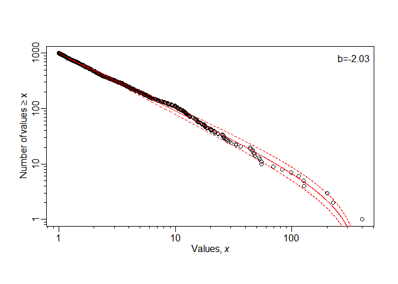
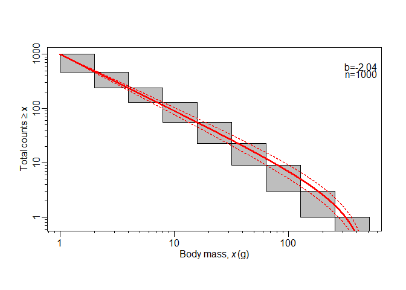
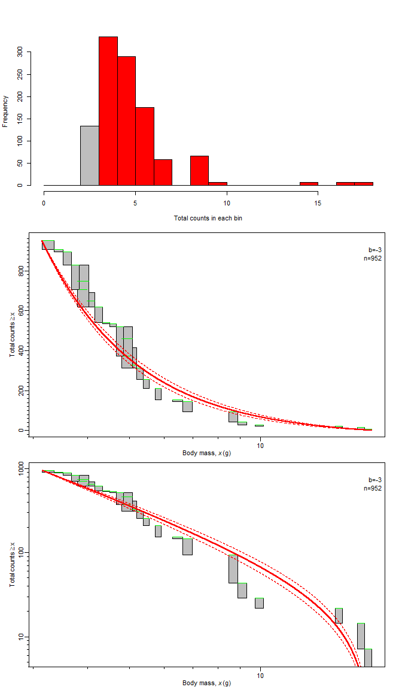

<!-- README.md is generated from README.Rmd. Please edit that file. -->

<!-- meth_method default looks to render fine on GitHub, but equations aren't -->

<!-- perfect when locally building and viewing the .html -->

<!-- which builds the .html that can be viewed locally (but isn't pushed to GitHub;
GitHub uses README.md to make the page you see on GitHub). See pacea if want to
save figures.
-->

# sizeSpectraFit

<!-- badges: start -->

<!-- [](https://lifecycle.r-lib.org/articles/stages.html#under development) connection timed out, -->

<!-- 17/9/25, but extracting what's needed here, just does not link to a website-->


[](https://github.com/andrew-edwards/sizeSpectraFit/actions/workflows/R-CMD-check.yaml)
[](https://app.codecov.io/gh/andrew-edwards/sizeSpectraFit?branch=main)

<!-- badges: end --> <!-- see data-raw/ for logo hexSticker code-->

A streamlined R package for fitting size spectra to ecological data

**Under development, though functions are all working**

Friday 8th May 2026

Want to fit a size spectrum to your data? This package provides a single
function for fitting, conveniently called `fit_size_spectrum()`. There
are standardised `plot()` functions to easily display results. And a lot
more. Please read on.

The first use of sizeSpectraFit is in our new paper ‘No-take reserve
improves size spectra and community structure of demersal megafauna in
the Northwestern Mediterranean Sea’ in *Global Ecology and Conservation*
[\[3\]](https://www.sciencedirect.com/science/article/pii/S2351989426001769).

The package is usable, though I am still writing some of the help files
and completing the automating testing. The functions are all working, so
feel free to download and use sizeSpectraFit. But please check back and
redownload when there is no ‘under development’ badge or warning above.
Note that some functions here may be improved by then (and so you may
have to update any code you have written); once no longer ‘under
development’ I will ensure full back compatibility and will document
changes in the NEWS file.

Below is some background on size spectra plus simple examples of fitting
size spectra to different types of data using the package. For more
details see the vignettes, that are rendered as .html on this GitHub
site and listed below in the [vignettes
section](https://github.com/andrew-edwards/sizeSpectraFit/tree/main#vignettes).

## Background

The size spectrum of an ecological community characterizes how a
property, such as abundance or biomass, varies with body size. Size
spectra are often used as ecosystem indicators of marine systems. Past
applications have included groundfish trawl surveys, visual surveys of
fish in kelp forests and coral reefs, sediment samples of benthic
invertebrates and satellite remote sensing of chlorophyll, as well as
terrestrial systems. Various methods have been used to fit size spectra
over the past decades. In our [*Methods in Ecology and Evolution*
paper](http://onlinelibrary.wiley.com/doi/10.1111/2041-210X.12641/full)
\[1\] we tested eight such methods and recommended the use of maximum
likelihood. In our [*Marine Ecology Progress Series*
paper](https://www.int-res.com/abstracts/meps/v636/p19-33/) \[2\] we
extended the likelihood method to properly account for the bin structure
of data. In our new [*Global Ecology and Conservation* accepted
paper](https://www.sciencedirect.com/science/article/pii/S2351989426001769)
\[3\], we developed a general theory for aggregating size spectra
together from different species groups that have differing
catchabilities, culminating in the new normalised aggregated size
spectrum. The methods in \[1\] and \[2\] have been widely used in
applications around the worldwide (I will add some examples here).

This package provides code for fitting size spectra to ecological data
using maximum likelihood methods. This is a new user-friendly package
written from the ground up rather than adapting old code into a package,
and with a focus on applying methods to users’ data rather than
reproducing results from our earlier papers. This overcomes some
shortcomings of the earlier
[sizeSpectra](https://github.com/andrew-edwards/sizeSpectra) package.
The methods used are described in detail in \[1\]-\[3\]. The papers
should be read to properly understand the package (rather than have
technical mathematical details repeated too much here).

## Quick start to show ease of use

The core function is `fit_size_spectrum()`, which automatically detects
what kind of data you have, and uses the MLE (maximum likelihood
estimate) or MLEbin (maximum likelihood estimate for binned data)
appropriately.

### Individual body sizes

For a vector of numerical numbers representing body sizes (e.g. body
masses of fish), for demonstration we use the simulated vector of values
from \[1\] (which are saved in the package as `sim_vec`):

``` r
res <- fit_size_spectrum(sim_vec)

plot(res)
```



This matches the recommended Figure 2a of \[1\], showing the total
counts of individuals $\geq$ each body mass on the x-axis as points,
with the red curve being the fitted power-law distribution and the
dashed curves the distribution using the 95% confidence limits of the
size spectra exponent $b$; the MLE of $b$ and the sample size $n$ are
shown in the top-right corner. The list `res` contains full details for
the results, where `b_mle` is the maximum likelihood estimate of $b$,
`b_conf` is the 95% confidence interval, `x` is the original data used
(i.e. `sim_vec` above; only the first 10 values are printed for
brevity), `x_min` and `x_max` are the minimum and maximum possible
values of body mass, and `method` gives the method used for fitting:

``` r
res
#> $b_mle
#> [1] -2.029697
#> 
#> $b_conf
#> [1] -2.097417 -1.964317
#> 
#> $x
#>  [1] 11.613220 15.658847  1.400273  5.869136  2.786321  2.077175  3.785753  1.155444
#>  [9]  2.909813  3.382489
#> 
#> $x_min
#> [1] 1.000239
#> 
#> $x_max
#> [1] 398.7787
#> 
#> $method
#> [1] "MLE"
```

### Body sizes that are binned

Often data are already binned, and only available to a certain
resolution (e.g. 1-2 g, 2-3 g, 3-4 g, etc.). We have the example
`sim_vec_binned` saved as a dataframe (actually a tibble) in the
package. We can simply use the same `fit_size_spectrum()` function as
above. The MLEbin method gets used because `sim_vec_binned` is a
dataframe with the correctly defined columns (namely `bin_min`,
`bin_max`, and `bin_count`, representing the minimum and maximum
endpoints of each bin and the count of individuals in that bin, with one
row for each bin):

``` r
sim_vec_binned
#> # A tibble: 9 × 3
#>   bin_min bin_max bin_count
#>     <dbl>   <dbl>     <int>
#> 1       1       2       528
#> 2       2       4       228
#> 3       4       8       113
#> 4       8      16        75
#> 5      16      32        33
#> 6      32      64        14
#> 7      64     128         6
#> 8     128     256         2
#> 9     256     512         1

res_mlebin <- fit_size_spectrum(sim_vec_binned)

plot(res_mlebin)
```



Each rectangle represents a bin, with the horizontal span indicating the
range of body masses for that bin, and the vertical span showing the
possible range of the number of individuals with body mass ≥ the body
mass of individuals in that bin (the uncertainty arises because
individuals in a bin could really be of any body mass within the bin).

Again, the full results are saved as a list, with `data` representing
the original data:

``` r
res_mlebin
#> $b_mle
#> [1] -2.035029
#> 
#> $b_conf
#> [1] -2.104249 -1.968419
#> 
#> $data
#> # A tibble: 9 × 6
#>   bin_min bin_max bin_count count_gte_bin_min low_count high_count
#>     <dbl>   <dbl>     <int>             <int>     <int>      <int>
#> 1       1       2       528              1000       472       1000
#> 2       2       4       228               472       244        472
#> 3       4       8       113               244       131        244
#> 4       8      16        75               131        56        131
#> 5      16      32        33                56        23         56
#> 6      32      64        14                23         9         23
#> 7      64     128         6                 9         3          9
#> 8     128     256         2                 3         1          3
#> 9     256     512         1                 1         0          1
#> 
#> $x_min
#> [1] 1
#> 
#> $x_max
#> [1] 512
#> 
#> $method
#> [1] "MLEbin"
#> 
#> attr(,"class")
#> [1] "size_spectrum_mlebin" "list"
```

### Body masses calculated from length data

In [\[2\]](https://www.int-res.com/abstracts/meps/v636/p19-33/) we
introduced the MLEbins method for fitting size spectra while accounting
for species-specific body-mass bins. Unlike the above example, the bins
can overlap. Here we demonstrate our fitting and plotting code for an
example data set from
[\[3\]](https://www.sciencedirect.com/science/article/pii/S2351989426001769).
See the paper and the
[fit-data-mlebins.html](http://htmlpreview.github.io/?https://github.com/andrew-edwards/sizeSpectraFit/blob/main/vignettes/fit-data-mlebins.html)
vignette for full details.

Specifically we fit the size spectrum for the small cephalopoda species
group in the fishing grounds strata (reproducing Fig. B.14 of
[\[3\]](https://www.sciencedirect.com/science/article/pii/S2351989426001769)).
For brevity the wrangling for that (see the
[fit-data-mlebins.html](https://andrew-edwards.github.io/sizeSpectraFit/vignettes/fit-data-mlebins.html)
vignette) has already been done and the required dataset saved in the
package as a tibble of data where each row represents a species-bin
combination, including the count for that bin:

``` r
data_cephsmall_fg
#> # A tibble: 28 × 4
#>    species         bin_min bin_max bin_count
#>    <fct>             <dbl>   <dbl>     <dbl>
#>  1 Abralia veranyi    2.46    2.60     61.3 
#>  2 Abralia veranyi    2.60    2.75     64.6 
#>  3 Abralia veranyi    2.89    3.05      7.35
#>  4 Illex coindetii    3.14    3.35     43.9 
#>  5 Abralia veranyi    3.35    3.51     14.8 
#>  6 Abralia veranyi    3.51    3.67     64.8 
#>  7 Abralia veranyi    3.67    3.83     79.4 
#>  8 Illex coindetii    3.79    4.03     43.2 
#>  9 Abralia veranyi    3.83    3.99     58.4 
#> 10 Abralia veranyi    3.99    4.16     29.4 
#> # ℹ 18 more rows
```

Bins represent body mass. Note the overlapping bins in rows 7 and 8, and
also in rows 8 and 9, because the bins correspond to different species
which have different length-weight coefficients (see
[\[3\]](https://www.sciencedirect.com/science/article/pii/S2351989426001769)).

The minimum body size to fit, $x_{min}$, is determined using a method
described in
[\[3\]](https://www.sciencedirect.com/science/article/pii/S2351989426001769).
Basically, since the size spectrum is a decreasing distribution, if we
have no *a priori* reason for setting $x_{min}$ then we determine it
from the data based on the peak of a simple histogram. This is
incorporated into the function `determine_xmin_and_fit_mlebins()`.

``` r
res_cephsmall_fg <- determine_xmin_and_fit_mlebins(data_cephsmall_fg)  # takes a few minutes
```

<!-- `res_cephsmall_fg` is actually saved as a data object in the package so -->

<!-- this file renders quickly; hence the `eval=FALSE` in the above chunk -->

We can then plot the results:

``` r
plot(res_cephsmall_fg)
```



The top panel is a histogram of total counts of minimum body sizes,
using 1-g body-size bins, used to determine $x_{min}$. The left-most red
bin is the modal bin, and $x_{xmin}$ for this group-strata combination
is the minimum value within that 1-g bin.

Middle and bottom panels (as suggested in Figure 7 of
[\[2\]](https://www.int-res.com/abstracts/meps/v636/p19-33/)) are the
fit of the bounded power-law distribution using the MLEbins method with
linear and logarithmic y-axes, respectively. For each body-mass bin, the
green horizontal line show the range of body sizes, with its value on
the y-axis corresponding to the total number of individuals in bins
whose minima are $\geq$ the bin’s minimum; the green lines help to
distinguish each bin when bins are overlapping. The vertical span of
each grey rectangle shows the possible range of number of individuals
with body masses $\geq$ body mass of individuals in that bin (horizontal
span matches the green line). Red curves are fits of the MLE, with
dashed lines showing 95% confidence intervals.

For full explanations see the vignettes; note that some of the above
fits are very good because the data have been simulated from a bounded
power-law distribution.

## Vignettes

Three vignettes for sizeSpectraFit go into more details than shown
above. Also see the help files for the functions for more details. The
vignettes are rendered and viewable on GitHub at:

- [fit-data.html](https://andrew-edwards.github.io/sizeSpectraFit/vignettes/fit-data.html)
  – the MLE and MLEbin methods in more detail than shown above, plus
  with extra plotting ideas
- [fit-data-mlebins.html](https://andrew-edwards.github.io/sizeSpectraFit/vignettes/fit-data-mlebins.html)
  – the MLEbins method including further results, calculations,
  explanations, and figure options.
- [fit-aggregate.html](https://andrew-edwards.github.io/sizeSpectraFit/vignettes/fit-aggregate.html)
  – our new normalised aggregated size spectrum, as described in
  [\[3\]](https://www.sciencedirect.com/science/article/pii/S2351989426001769)

To run and adapt the code yourself, simply download the raw R Markdown
files from
[fit-data.Rmd](https://github.com/andrew-edwards/sizeSpectraFit/blob/main/vignettes/fit-data.Rmd),
[fit-data-mlebins.Rmd](https://github.com/andrew-edwards/sizeSpectraFit/blob/main/vignettes/fit-data-mlebins),
or
[fit-aggregate.Rmd](https://github.com/andrew-edwards/sizeSpectraFit/blob/main/vignettes/fit-aggregate.Rmd).

Run the file locally, and then adapt it for your own data.

## Installation

To install the latest version just:

    install.packages("remotes")    # If you do not already have the "remotes" package

    remotes::install_github("andrew-edwards/sizeSpectraFit")

If you get an error like

    Error in utils::download.file(....)

then the connection may be timing out (this happens to me on our work
network). Try

    options(timeout = 1200)

and then try and install again. If you get a different error then post
an Issue or contact
<a href="mailto:andrew.edwards@dfo-mpo.gc.ca">Andy</a> for help.

## Citation and troubleshooting

If you use `sizeSpectra` in your work then please cite it, currently as
the following (I hope to write a short manuscript about it soon):

Edwards, A. M. (2026). sizeSpectraFit: A streamlined R package for
fitting size spectra to ecological data. R package version 1.0.0,
<https://github.com/andrew-edwards/sizeSpectraFit>.

I do plan to improve, extend, and maintain the package in the future;
knowing it’s being used gives extra motivation.

If you want a citation for LaTeX and R Markdown bibliographies then
after installation type `citation("sizeSpectraFit")` .

Please report any bugs or suggestions as [an
Issue](https://github.com/andrew-edwards/sizeSpectraFit/issues), or
email <a href="mailto:andrew.edwards@dfo-mpo.gc.ca">Andrew Edwards</a>
for help.

## References

\[1\] **Testing and recommending methods for fitting size spectra to
data** by Andrew M. Edwards, James P. W. Robinson, Michael J. Plank,
Julia K. Baum and Julia L. Blanchard. ***Methods in Ecology and
Evolution*** (2017, 8:57-67). Freely available at
<http://onlinelibrary.wiley.com/doi/10.1111/2041-210X.12641/full>.

\[2\] **Accounting for the bin structure of data removes bias when
fitting size spectra** by Andrew M. Edwards, James P. W. Robinson, Julia
L. Blanchard, Julia K. Baum and Michael J. Plank. ***Marine Ecology
Progress Series*** (2020, 636:19-33). Freely available at
<https://www.int-res.com/abstracts/meps/v636/p19-33/>.

\[3\] **No-take reserve improves size spectra and community structure of
demersal megafauna in the Northwestern Mediterranean Sea** by Juliana
Quevedo, Nixon Bahamon, Andrew M. Edwards, Maria Vigo, Pablo Couve,
Jacopo Aguzzi, Jorge Paramo, and Joan B. Company. ***Global Ecology and
Conservation*** (2026, 68:e04227). Freely available at
<https://www.sciencedirect.com/science/article/pii/S2351989426001769?via%3Dihub>.

The actual code associated with \[3\] is in the
[report/mediterranean](https://github.com/andrew-edwards/sizeSpectraFit/tree/main/report/mediterranean)
folder as documented in its README file
[READmediterranean.txt](https://github.com/andrew-edwards/sizeSpectraFit/tree/main/report/mediterranean/READmediterranean.txt).

<!-- 
### Might still want to copy these dieas from hdiAnalysis:
&#10;Could be useful template:
&#10;* [results.html](http://htmlpreview.github.io/?https://github.com/andrew-edwards/hdiAnalysis/blob/main/vignettes/results.html)
  -- Designed as a template for users to analyse their own data, by reproducing the results in
  the manuscript as an example.
* [results-extra.html](http://htmlpreview.github.io/?https://github.com/andrew-edwards/hdiAnalysis/blob/main/vignettes/results-extra.html)
  -- Includes further results, calculations, explanations, and figure options.
&#10;To run and adapt the code yourself, simply download the raw R Markdown files
from
[results.Rmd](https://github.com/andrew-edwards/hdiAnalysis/blob/main/vignettes/results.Rmd)
or [results-extra.Rmd](https://github.com/andrew-edwards/hdiAnalysis/blob/main/vignettes/results-extra.Rmd).
Run the file locally, and then adapt it for your own data.
-->
