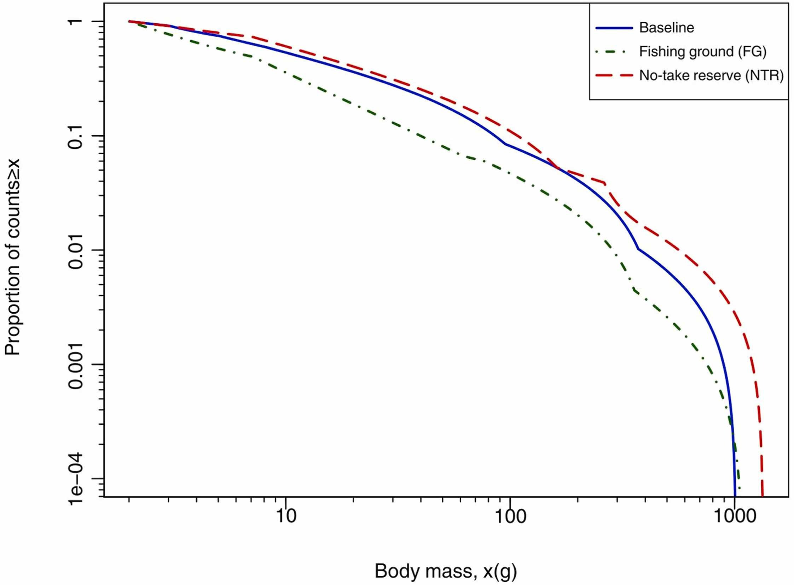

```{r, instr, echo = FALSE, eval = FALSE}
# To build either run this line or click knit button in RStudio
rmarkdown::render("fit-aggregated.Rmd")
```

```{r, load, include = FALSE}
load_all()   # TODO replace with library(sizeSpectraFit)

knitr::opts_chunk$set(
  collapse = TRUE,
  comment = " ",
  fig.width = 7,
  fig.height = 6
)
```

We demonstrate the normalised aggregated size spectrum here, as developed in
[Quevedo et
al. (2026)](https://www.sciencedirect.com/science/article/pii/S2351989426001769),
which should be consulted for full details (see Appendix B). We first briefly
show the main result from the paper, and then show code to build up a similar
figure from simulated data to aid understanding. Users can replace the simulated
data with their own data.

The idea is that we can fit size spectra to different components of the community,
but it is inappropriate to fit a single size spectrum to the full community
because of differences in sampling protocols between different species
groups. For example, the sampling of zooplankton (e.g. using bongo nets) and
pelagic fish (e.g. using a midwater trawl net) are quite different, and we cannot
simply combine the data for a single size spectrum fit. In [Quevedo et
al. (2026)](https://www.sciencedirect.com/science/article/pii/S2351989426001769) we
had five different species groups; although the organisms were all sampled using
bottom trawl gear, the catchability of the gear is expected to differ between
species groups. So we fit each group
separately and then derived and produced a combined normalised aggregated size
spectrum. This was done for three different sampling scenarios or strata (a baseline, a no-take
reserve that was protected from fishing, and fishing grounds), resulting in 
Figure 5 in the paper:

```{r, fig5, echo = FALSE, out.width = 400}

```

The curves are for bottom trawl surveys for three scenarios: Baseline conditions, and then
four years later after implementation of a No-Take Reserve (Marine
Protected Area) surveys were done both within the reserve (NTR) and outside in the fishing
grounds (FG). The above plot is the normalised aggregated size spectrum for all
three scenarios. This required developing aggregated size spectra that are then
normalised to plot on the same axes. The figure shows individual body masses on
the x-axis, with the proportion of
organisms $\geq$ each body mass shown on the y-axis.

Key aspects are:

- the fits are not simple straight lines or curves, because they are aggregated
- the FG spectrum declines faster than the Baseline (note the logarithmic
y-axis such that apparently minor graphical differences are actually quite
large) 
- the NTR spectrum declines more slowly (shallower) than the
Baseline
- the appearance of large organisms showing up in
the NTR. 

Comparisons between scenarios have to be interpreted from the figure because there is no
quantitative exponent that can be calculated from the aggregated size spectra.

Here we simulate some data to show the code needed to fit a normalised
aggregated size spectrum (NASS). We first use individual body sizes, and then do
the same for data that are only available in binned form. 

## Generate simulated data

We first consider a single sampling scenario, and then later simulate fishing on
larger organisms. We simulate $S = 4$ different
species groups from different bounded power law (PLB) 
distributions. Using simulated data means that the fits should be much better than expected from real noisy
data, but the point is to show how to use the code and to aid
understanding (we had to do such an example to flesh out the ideas).

Each sample has a different sample size, assumed size spectrum exponent, and
range of body sizes, prescribed as vectors:

```{r simulations}
set.seed(42)

S <- 4

# For each sample, prescribe the sample size, exponent b, xmin and xmax.
n_vec <- c(6000, 6000, 1600, 2000)
b_vec_known <- c(-1.09, -2, -3, -4)
xmin_known <- c(0.3, 10, 100, 300)
xmax_known <- c(80, 4000, 1000, 1500)

res_list <- list()                      # To save results

for(s in 1:S){
  x_values <- rPLB(n_vec[s],            # Simulate values for sample s
                   b = b_vec_known[s],
                   xmin = xmin_known[s],
                   xmax = xmax_known[s])

  res_list[[s]] <- fit_size_spectrum(x_values)    # x_values get automatically saved
                                                  # as res_list[[s]]$x
}

# Work out a global x-axis to use for the next plots:
xlim_global <- range(res_list[[1]]$x)
for(s in 2:S){
  xlim_global <- range(xlim_global,
                        range(res_list[[s]]$x))
}
xlim_global
```

Here are the four data sets with the four individually fit PLB distributions (the fits are good as data were simulated from PLB distributions):
```{r plotting, fig.height = 9}
# Use the first S of the default colours from plot_aggregate(), for consistency
#  with later plots:
col_vec <- eval(formals(plot_aggregate)$col_vec)[1:S]
  
par(mfrow = c(S, 1),
    mai = c(0.6, 0.5, 0.05, 0.3),
    mar = c(4.1, 4.1, 2.1, 2.1))

for(s in 1:S){
  plot(res_list[[s]],
       xlim = xlim_global,
       fit_col = col_vec[s],
       main = paste0("Species group ", s),
       legend_text_second_row_multiplier = 4)
}
```
The extra plotting arguments are to improved the plot, see
`?plot.size_spectrum_numeric`, which is used because we have
```{r, class}
class(res_list[[s]])
```


### Aggregating distributions

So we have `r S` fitted distributions that we want to aggregate, which we can do
and plot with a single function:

```{r plotagg, fig.cap = "The four fitted PLB's from above are shown on common axes using the same colour coding as above. Black circles are the full aggregated data set, and the thick magenta curve is the aggregated PLB distribution, the distribution obtained from aggregating the four fitted PLB's together. The black circles are mostly hidden behind the magenta curve for low values of $x$, and at high values are overlaid by the light blue circles because those represent the only data for high $x$. The fits are very good because the data are simulated from PLB's, and likelihood was used to estimated the $b$ exponents."}
orig_agg_fit <- plot_aggregate(res_list)
```

### Simulate disproportionate removal of larger individuals

To roughly simulate fishing, we take the above simulated data and
disproportionately remove larger fish within each species group. We just remove
10% of the smallest half of the sizes, and 50% of the largest half, within each
species group. This gives us the 'fished' scenario or strata (in the main text
of the paper we used the term 'sampling scenario', but the raw data used
'strata' so this is what we use for the code and in Appendix B).

```{r, removeinds}
res_fished_list <- list()
set.seed(42)                       # for reproducibility
for(s in 1:S){
  ind_sizes <- sort(res_list[[s]]$x)

  # Remove 10% of small fish and 50% of large within the group.
  num_sizes <- length(ind_sizes)        # Assume to be even
  indices_to_keep <- c(sample(1:(num_sizes/2),   
                              size = 0.90 * num_sizes/2),
                       sample((num_sizes/2 +1):num_sizes,
                              size = 0.50 * num_sizes/2))
  x_values <- ind_sizes[indices_to_keep]
  
  res_fished_list[[s]] <- fit_size_spectrum(x_values)  # x_values get automatically saved 
                                                       # as res_fished_list[[s]]$x
}
```

Here are the four data sets with the four individually fit PLB distributions
```{r plotting2, fig.height = 8}
par(mfrow = c(S, 1),
    mai = c(0.6, 0.5, 0.05, 0.3),
    mar = c(4.1, 4.1, 2.1, 2.1))

for(s in 1:S){
  plot(res_fished_list[[s]],
       xlim = xlim_global,
       fit_col = col_vec[s],
       main = paste0("Species group ", s),
       legend_text_second_row_multiplier = 4)
}
```

And here is the normalised aggregated size spectrum in magenta:
```{r, fishedagg}
fished_agg_fit <- plot_aggregate(res_fished_list)
```

To compare the original and the 'fished' normalised aggregated size spectra,
first combine in a list.
```{r, fishedagglist}
agg_list <- list(orig_agg_fit,
                 fished_agg_fit)
strata <- c("unfished",
            "fished")
```
We can then simply use the `plot_aggregate_fits()` function to plot the results
for the two strata on the same graph, first without restriction to a common
range of body masses or normalisation:
```{r combinedplotfunct, fig.cap = "The two aggregated plots restricted to a common range of body masses and then normalised, to properly compare them.", fig.height = 6}
plot_aggregate_fits(agg_list,
                    strata_names = strata,
                    ylim = c(10^(-4), 20000),
                    restrict = FALSE,
                    normalise = FALSE)
```
Both strata span the same range of body sizes (unlike for Figure B.22 in the
paper).
Since there is no simple size-spectrum exponent for such aggregated fits, and
they have different $x_{min}$ values (at least in Figure B.22) and sample sizes,
the fits are hard to compare. 

Hence, we now restrict the fits to
values above a common value (namely the maximum of the two aggregated
$x_{min}$ values), and then normalise each aggregated fit by its resulting
sample size, such that each starts at the same point (same body-mass on the
x-axis and at 1 on the y-axis, which now represents the proportion (not number) of values
above each body-mass). So with these options (the defaults are `restrict = TRUE`
and `normalise = TRUE`) we have the normalised aggregated size spectra:

```{r combinedplotnormfunct, fig.cap = "The two aggregated plots restricted to a common range of body masses and then normalised giving the normalised aggregated size spectra, to properly compare them.", fig.height = 6}
plot_aggregate_fits(agg_list,
                    strata_names = strata,
                    ylim = c(10^(-4), 1))
```
Note that the y-axis is automatically labelled as the proportion of counts
$\geq x$ rather than the total.
This clearly shows a 'steepening' of the size spectrum for the fished scenario compared
 to the baseline -- the counts are dropping off faster under
the `fished' scenario. Note the logarithmic
y-axis, such that apparently minor differences are actually quite large.
To
further understanding, we also plot the same figure but with a linear y-axis:

```{r combinedplotnormlinear, fig.height = 6}
plot_aggregate_fits(agg_list,
                    strata_names = strata,
                    log_axes = "x")
```

Again, this shows the fished strata size spectrum declining faster than that of
the unfished strata. Note that both curves have to start at the same point, and
reach 0 on the y-axis; minor changes that we see here are therefore indeed of
importance (because the differences can only be so big).

### More extreme removal example

To further illustrate the NASS idea, we repeat the above simulation experiment
but simply remove 50% of all 
individuals $\geq$ 100 g. The code is largely the same as above, with changes to the
removal of individuals.

```{r, removeinds2}
res_fished_list_2 <- list()
set.seed(42)    # for reproducibility
for(s in 1:S){
  indiv_sizes <- sort(res_list[[s]]$x)

  # Remove 50% of any individuals > 100 g
  num_sizes <- length(indiv_sizes) 
  indiv_sizes_over_100 <- indiv_sizes[indiv_sizes >= 100]
  
  x_values <- c(indiv_sizes[indiv_sizes < 100],
                sample(indiv_sizes_over_100,
                       size = floor(0.5 * length(indiv_sizes_over_100))))

  res_fished_list_2[[s]] <- fit_size_spectrum(x_values)
}
```

Here are the four data sets with the four individually fit PLB distributions
```{r plotting3, fig.height = 8}
par(mfrow = c(S, 1),
    mai = c(0.6, 0.5, 0.05, 0.3),
    mar = c(4.1, 4.1, 2.1, 2.1))

for(s in 1:S){
  plot(res_fished_list_2[[s]],
       xlim = xlim_global,
       fit_col = col_vec[s],
       main = paste0("Species group ", s),
       legend_text_second_row_multiplier = 4)

}
```

And here is the normalised aggregated size spectrum in magenta:
```{r, fishedagg2}
fished_agg_fit_2 <- plot_aggregate(res_fished_list_2)
```

To compare the original and the 'fished' normalised aggregated size spectra,
combine in a list.
```{r, fishedagglist2}
agg_list_2 <- list(orig_agg_fit,
                 fished_agg_fit_2)
```
The normalised aggregated size spectra is

```{r combinedplotnormfunct2, fig.cap = "The two aggregated plots restricted to a common range of body masses and then normalised, to properly compare them.", fig.height = 6}
plot_aggregate_fits(agg_list_2,
                    strata_names = strata,
                    ylim = c(10^(-4), 1))
```
showing the reduction due to fishing.
And with a linear y-axis:

```{r combinedplotnormlinear2, fig.height = 6}
plot_aggregate_fits(agg_list_2,
                    strata_names = strata,
                    log_axes = "x")
```

## Doing the above but for binned data

HERE

The same analyses can be done for data that are only available in binned
form. See TODO (Juliana's) for an example using the MLEbins method, for which we
have lengths that are converted to weights using species-specific length-weight
relationships.

Here we simulate the same data as above and then bin it, to then fit using the
MLEbin method and consequent plotting.

```{r simulationsmlebin}
set.seed(42)

res_mlebin_list <- list()                      # To save results

for(s in 1:S){
  x_values <- rPLB(n_vec[s],
                   b = b_vec_known[s],
                   xmin = xmin_known[s],
                   xmax = xmax_known[s])

  x_values_binned <- bin_data(x_values,
                              bin_width = 20)$bin_vals

  # Without this x_min would get set to zero, as detailed in error message in
  #  fit_size_spectrum_mlebin
  if(min(x_values_binned$bin_min) == 0){
    x_values_binned[which(x_values_binned$bin_min == 0), "bin_min"] <- 0.00001
  }
  
  res_mlebin_list[[s]] <- fit_size_spectrum(x_values_binned)
                 # binned data get included in res_mlebin_list[[s]]
}


# Plot each figure with same global x-axis:
xlim_global_mlebin <- c(min(res_mlebin_list[[1]]$data$bin_min),
                        max(res_mlebin_list[[1]]$data$bin_max))
for(s in 2:S){
  xlim_global_mlebin <- range(xlim_global_mlebin,
                              min(res_mlebin_list[[s]]$data$bin_min),
                              max(res_mlebin_list[[s]]$data$bin_max))
}
xlim_global_mlebin
```

Here are the four data sets with the four individually fit PLB distributions as
calculated using the MLEbin method:
```{r plotting4, fig.height = 8}
par(mfrow = c(min(S, 4), 1),
    mai = c(0.6, 0.5, 0.05, 0.3))

for(s in 1:S){
  plot(res_mlebin_list[[s]],
       xlim = xlim_global_mlebin,
       fit_col = col_vec[s],
       rect_border_col = col_vec[s])
}
```

### Aggregating distributions

Aggregate as before:

```{r plotaggmlebin, fig.cap = "The four fitted PLB's from above, calculated using the MLEbin method, are shown on the sames axes using the same colour coding as above. Magenta rectangles are for the full aggregated data set, and the thick magenta curve is the aggregated PLB distribution, the distribution obtained from aggregating the four fitted PLB's together. "}
orig_agg_fit_mlebin <- plot_aggregate_mlebin(res_mlebin_list)
```

### Simulate disproportionate removal of larger individuals

We repeat the above `More extreme removal example` here, using the same idea
(simply removing 50% of all individuals $\geq$ 100 g, based on `bin_min`),
but binning the data and then fitting it using the MLEbin method.

```{r, removeinds2mlebin}
res_mlebin_fished_list <- list()
set.seed(42)    # for reproducibility
for(s in 1:S){
  # Just half the count for the fished sizes
  x_values_binned_fished <- res_mlebin_list[[s]]$data %>%
    dplyr::select(`bin_mid`:`bin_count`) %>%
    dplyr::mutate(bin_count = dplyr::if_else(bin_min >= 100,
                                             bin_count / 2,
                                             bin_count))
  
  res_mlebin_fished_list[[s]] <- fit_size_spectrum(x_values_binned_fished)
}
```

Here are the four data sets with the four individually fit PLB distributions
```{r plotting5, fig.height = 8}
par(mfrow = c(min(S, 4), 1),
    mai = c(0.6, 0.5, 0.05, 0.3))

for(s in 1:S){
  plot(res_mlebin_fished_list[[s]],
       xlim = xlim_global_mlebin,
       fit_col = col_vec[s],
       rect_border_col = col_vec[s])       
}
```

And here is the normalised aggregated size spectrum in magenta:
```{r, fishedagg3}
fished_agg_fit_mlebin <- plot_aggregate_mlebin(res_mlebin_fished_list)
```

To compare the original and the `fished' normalised aggregated size spectra,
first combine in a list.
```{r, fishedagglist3}
agg_list_mlebin <- list(orig_agg_fit_mlebin,
                        fished_agg_fit_mlebin)
strata <- c("unfished",
            "fished")
```
We can then simply use the `plot_aggregate_fits()` function to plot the results
for the two strata on the same graph:

```{r combinedplotnormfunct3, fig.cap = "The two aggregated plots restricted to a common range of body masses and then normalised, to properly compare them.", fig.height = 6}
plot_aggregate_fits(agg_list_mlebin,
                    strata_names = strata,
                    ylim = c(10^(-4), 1))
```

And again with a linear y-axis:

```{r combinedplotnormlinear4, fig.height = 6}
plot_aggregate_fits(agg_list_mlebin,
                    strata_names = strata,
                    log_axes = "x")
```

Again, this shows the fished strata size spectrum declining faster than that of
the unfished strata. 

## Session information

```{r sessioninfo}
sessionInfo()
```
